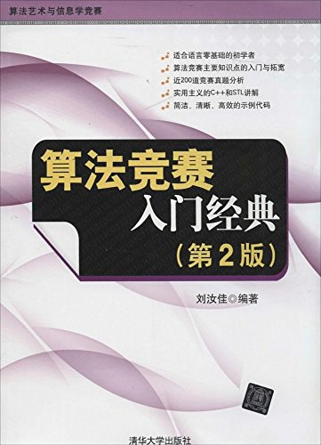

# 算法竞赛入门经典（第2版） 源码解答

[](https://github.com/ITcyx/LearnAlgorithm/tree/main/%E7%AE%97%E6%B3%95%E7%AB%9E%E8%B5%9B%E5%85%A5%E9%97%A8%E7%BB%8F%E5%85%B8%EF%BC%88%E7%AC%AC2%E7%89%88%EF%BC%89 "GitHub 主页")
[](https://gitee.com/ITcyx/LearnAlgorithm/tree/main/%E7%AE%97%E6%B3%95%E7%AB%9E%E8%B5%9B%E5%85%A5%E9%97%A8%E7%BB%8F%E5%85%B8%EF%BC%88%E7%AC%AC2%E7%89%88%EF%BC%89 "Gitee 主页")

[code 文件夹](./code/ "code 文件夹")里面是[《算法竞赛入门经典（第2版）》](https://book.douban.com/subject/25902102/ "《算法竞赛入门经典（第2版）》")例题和习题的源码解答。第1、2章，只有习题的源码解答。从第3章开始，加入了例题的源码解答。参考本书的编写方式，前4章的源码解答使用 C99 编写，后面章节的源码解答使用 C++11 编写。 code 文件夹下有以每个章节命名的子文件夹，对应的是该章节的源码解答。前两个章节的文件夹里面只有对应习题号命名的 .cpp 文件；后面章节的文件夹里有例题和习题两个子文件夹，例题子文件夹里面有对应例题号命名的 .cpp 文件，而习题子文件夹里面有对应习题号命名的 .cpp 文件。 .cpp 文件的编码方式均为 UTF-8 with BOM 。从第3章开始，所有源码可以直接在 [UVaOJ](https://onlinejudge.org/ "UVaOJ") 对应编号的题目上提交，并确保能 AC （具体意义可以参考后面的 [OJ 术语解释](#OJ-术语解释)），但本人习惯使用 [Virtual Judge](https://vjudge.net/ "Virtual Judge") ，后面将给出第3章以后所有的题目对应的 UVa 题号和其对应 Virtual Judge 上的链接。所有的源码均可在 [Visual Studio 2017](https://visualstudio.microsoft.com/zh-hans/vs/older-downloads/ "Visual Studio 2017") 上调试运行，但前4章用 C99 编写的源码无法直接在 Visual Studio 2017 上调试，可以参考后面的 [Visual Studio 2017 调试操作](#Visual-Studio-2017-调试操作)。

[](https://book.douban.com/subject/25902102/ "《算法竞赛入门经典（第2版）》")

### 目录

- [算法竞赛入门经典（第2版） 源码解答](#算法竞赛入门经典第2版-源码解答)
    - [目录](#目录)
    - [OJ 术语解释](#oj-术语解释)
    - [题目对应 UVa 题号、 Virtual Judge 链接和完成状态](#题目对应-uva-题号-virtual-judge-链接和完成状态)
        - [第3章（例题）](#第3章例题)
        - [第3章（习题）](#第3章习题)
    - [Visual Studio 2017 调试操作](#visual-studio-2017-调试操作)

### OJ 术语解释

OJ 术语|英文解释|中文解释
:-:|:-:|:-:
AC|Accepted|被 OJ 成功接受
WA|Wrong Answer|答案错
PE|Presentation Error|输出格式错
RE|Runtime Error|运行错
TLE|Time Limit Exceeded|超时
MLE|Memory Limit Exceeded|超内存
OLE|Output Limit Exceeded|超输出、写入
CE|Compilation Error|编译错误

### 题目对应 UVa 题号、 Virtual Judge 链接和完成状态

以下是从第3章开始的习题和例题对应的 UVa 题号和对应的 Virtual Judge 链接以及本人在 OJ 上 是否 AC 的状态。

##### 第3章（例题）

书本题号|UVa 题号|Virtual Judge 链接|状态
:-:|:-:|:-:|:-:
3-1|272|https://vjudge.net/problem/UVA-272|✅
3-2|10082|https://vjudge.net/problem/UVA-10082|✅
3-3|401|https://vjudge.net/problem/UVA-401|✅
3-4|340|https://vjudge.net/problem/UVA-340|✅
3-5|1583|https://vjudge.net/problem/UVA-1583|✅
3-6|1584|https://vjudge.net/problem/UVA-1584|✅

##### 第3章（习题）

书本题号|UVa 题号|Virtual Judge 链接|状态
:-:|:-:|:-:|:-:
3-1|1585|https://vjudge.net/problem/UVA-1585|✅

### Visual Studio 2017 调试操作

前4章的源码直接使用 Visual Studio 2017 会报错，原因是某些内置函数它会报不安全错误，要使用 _s 后缀的函数名代替，例如使用 scanf 函数时会报以下错误：

> error C4996: 'scanf': This function or variable may be unsafe. Consider using scanf_s instead. To disable deprecation, use _CRT_SECURE_NO_WARNINGS. See online help for details.

为了能够在本地正常调试并能使得源码不加修改地复制到 OJ 上运行，这里建议对 Visual Studio 2017 做出以下修改：

1. 点击工具栏的“项目”，在弹出的菜单中点击“ xxx 属性”（ xxx 表示的是该项目的名称，具体以自身的项目名为准）。


2. 点击弹出的窗口中左边的配置属性菜单中的“ C/C++ ”左边的三角图标，点击展开的二级菜单中的“预处理器”，再点击右边菜单中的“预处理器定义”，点击展开的箭头图标，选择“<编辑...>”。


3. 在上方的编辑栏输出```_CRT_SECURE_NO_WARNINGS```，点击右下角的“确认”。


4. 点击右下角的“确认”，完成最后的设置。

